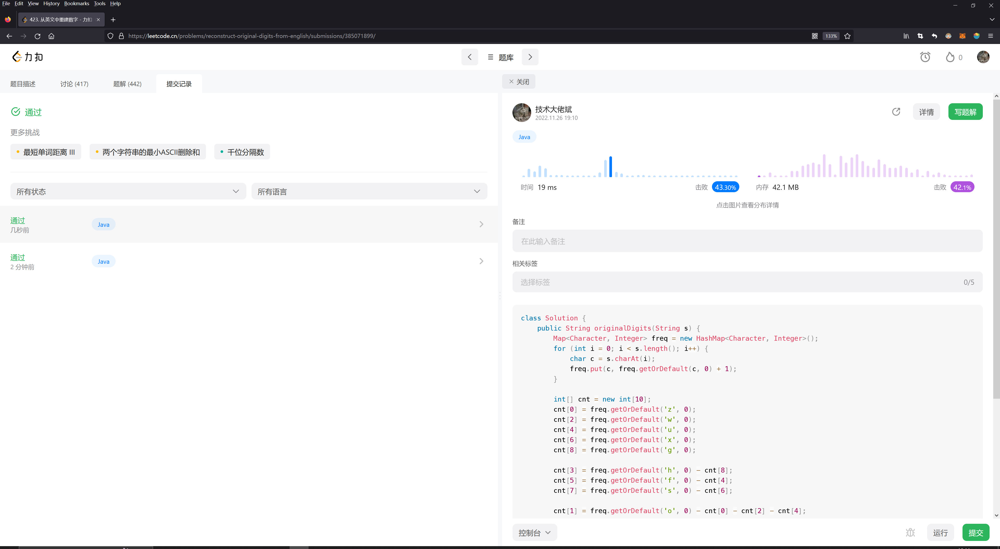

## Algorithm

## Review

原文链接：https://linus.coffee/note/no-code/

Comments:
之前只听说过 low-code，serverless 这种概念，no-code 倒是第一次听说。
no-code 的优点与缺点都很明显，优点是实现快，缺点是扩展难。

文章的核心是讨论 no-code 的适用场景，主要为以下两点：
1. Transitionary, ephemeral software （过渡期，生命短暂的产品）
2. High-churn code （变化极快，天天需要进行变动的产品）

其实这两种适用场景某些方面是很类似的，都比较在意软件的生命期很短这个特点。
这个也是由于 node 的优点和缺点同时决定的。

## Tip
本周暂无

## Share
本周暂无