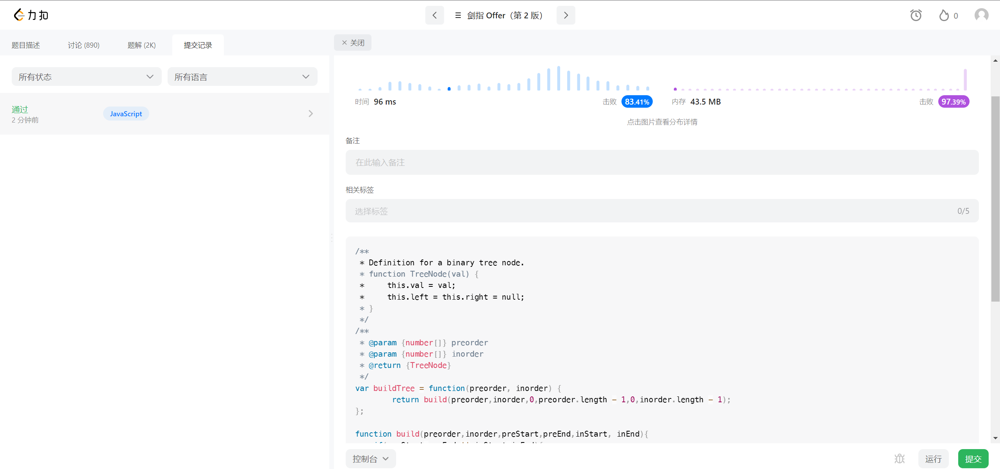

## Algorithm

## Review

[noise](https://css-tricks.com/making-static-noise-from-a-weird-css-gra)

震惊！老电视上的雪花图还可以使用 CSS 来做，只需要`repeating-radial-gradient` + `repeating-conic-gradient`+ ` background-blend-mode` + `animation`

主要是要将渐变将值拉到最低比如 0.0001%

## Tip

## Share
