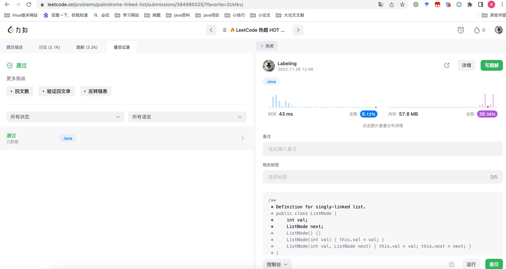

## Algorithm

### 回文链表
* 使用栈进行逆序比对是否相等
## Review
[无服务函数介绍](https://dev.to/nefejames/all-you-need-to-know-about-serverless-functions-and-the-edge-2bl2)
简单介绍`Serverless Functions`，及其相应厂商
## Tip
### mac docker 使用
Mac使用docker保持环境干净，防止大量后台常驻程序，进程级别虚拟，资源占用少。
安装：`homebrew install docker --crack`
docker mysql使用[参考](https://juejin.cn/post/7043826861272465445)
mac 使用docker：
```shell
# 常见指令
docker ps -a
docker images
docker start
docker stop
```
### redis cluster模式
redis cluster模式部署需求3主3备。如果只有三个节点，建议主被循环部署，否则挂掉一个节点会报错，找不到slot。
docker启动或创建后台进行，如果关闭需要到性能监视器进行完全退出
## Share
mysql 5.7 online ddl
语法如下：
```mysql
ALTER TABLE tbl_name ADD PRIMARY KEY (column), ALGORITHM=INPLACE, LOCK=NONE;
```
### 问题
线上变更DDL时可能出现死锁导致Mysql卡死无法登录，白屏等问题。
### 解决
Mysql执行`select * from information_schema.innodb_trx`查看被锁语句，通过`thread_id`在Mysql终端执行Kill
终止变更语句，停服务再进行变更。变更时尽量使用Online DDL，防止锁表。
### 相关资料
* [Mysql online ddl](https://www.cnblogs.com/dbabd/p/10381942.html)