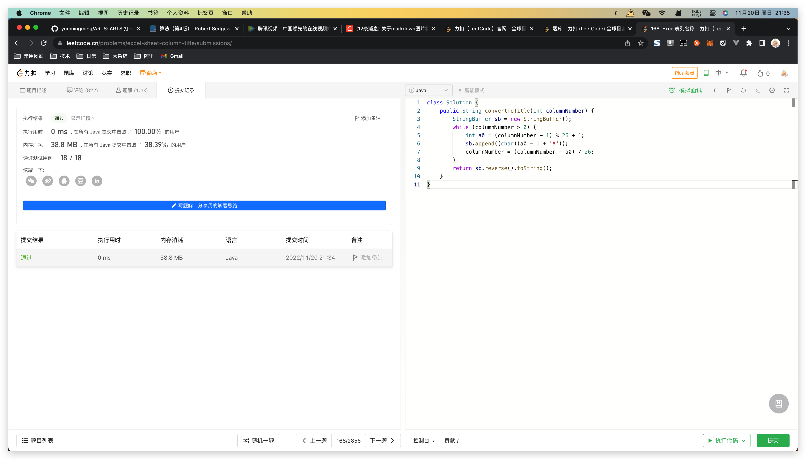

## Algorithm

## Review

[Why HTTP based Microservices is a BAD idea](https://habitual-consonant-4d8.notion.site/Why-HTTP-based-Microservice-is-a-BAD-idea-0c5843b222fc49ecaeddc2434a70b123)

## Tip

[Arthas vmtool 命令](https://arthas.aliyun.com/doc/vmtool.html)

在 Java 应用程序运行时，可以快捷的获取 JVM 中的内存对象，并使用对象执行动作。

## Share

[Tomcat 整体架构](https://qingming.notion.site/Tomcat-1-76cbf48dd4484f8197a4e7c1ad4c4d7f)
