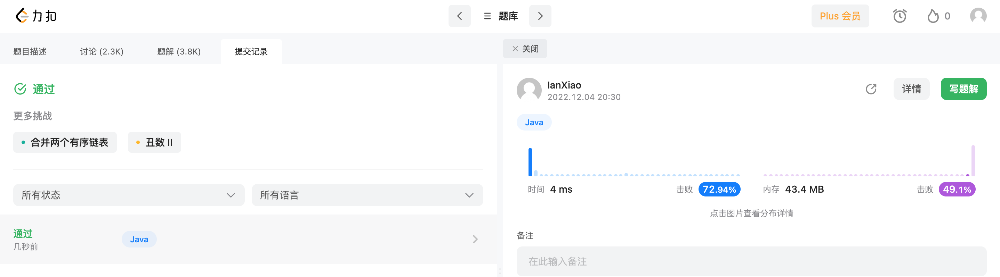

## Algorithm

## Review

[Reducing Logging Cost by Two Orders of Magnitude using CLP](https://www.uber.com/en-DE/blog/reducing-logging-cost-by-two-orders-of-magnitude-using-clp/)

Uber实践的一种日志压缩算法，实现了169倍的压缩，并且可以在不解压的情况下高效搜索。

大致的思路是：日志通常包含重复的字符串部分和会变动的变量部分，前者单独抽取成一个类型值对应字符串内容的字典，后者根据是否可以枚举分情况处理，对于可以枚举的变量也单独抽取成一个字典。通过采取这样公共字典的模式就可以去掉日志中绝大部分的冗余。同时由于变量内容和字符串内容都是以映射的方式表示，从而可以实现搜索。

不太明白的地方：字典的生成是自动的还是需要手动维护？手动维护每次新增一种打印的日志就需要新增一种类型是不是太麻烦了。。。
