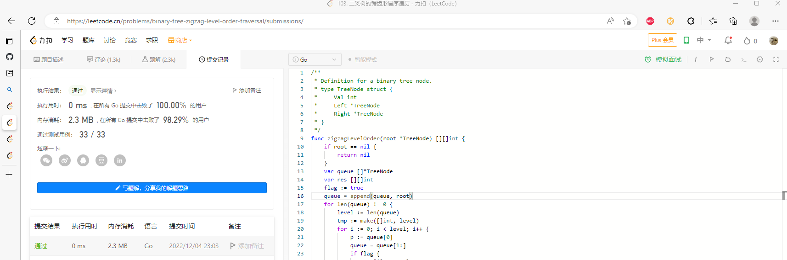

# Algorithm

# Review

[Time, clocks, and the ordering of events in a distributed system](https://dl.acm.org/doi/pdf/10.1145/359545.359563)

问题：现实判定事件发生的顺序，依靠物理时钟，物理时钟不是百分百准确的

解决：happened before 关系

* 同一进程内部先后发生的两个事件之间，具有「Happened Before」关系。
* 同一个消息的发送事件和接收事件，具有「Happened Before」关系
* 「Happened Before」满足传递关系

看待「Happened Before」关系的另一种方式，相当于是说，a→b意味着事件a有可能在因果性上对事件b产生影响。如果两个事件谁也无法影响对方，那么它们就属于并发关系

通过结合逻辑时钟给出的时间戳大小，以此得到全局排序的机制，其中所有事件的 happend before 关系都保持住了，通过人为的指定次序，结合状态机复制，能实现任何一个分布式系统！！（牛

# Tip

[vimium-c 浏览器高效全键盘工具](https://fuschia-route-dbf.notion.site/vimium-c-1701b1345d0545d8ad7981749ee2b66e)

# Share

[go 调度器的一些思考](https://fuschia-route-dbf.notion.site/go-aef4b96c1f22449e88de8bd2efb28be4)
