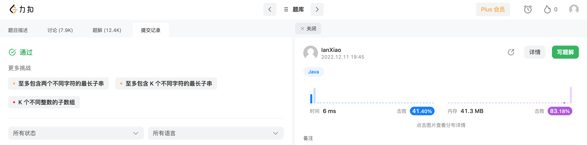

## Algorithm

## Review

[What Does Technical Debt Tell You?](https://www.infoq.com/articles/technical-debt-tells-you/)

讲了一下技术债务的定义、类型，以及了解它对于团队后期维护和升级的作用。

## Tips

[Alfred Workflow](https://www.alfredapp.com/workflows/)

- Alfred是Mac上的一个效率工具，可以作为启动器，粘贴板等
- 利用Alfred可以将一些常用的操作创建为Workflow，如字符串编解码、时间戳转换等，从而提升效率。

## Share

[重新思考了一下MVCC](https://ianxiao2.github.io/2022/12/11/mysql-mvcc/)
