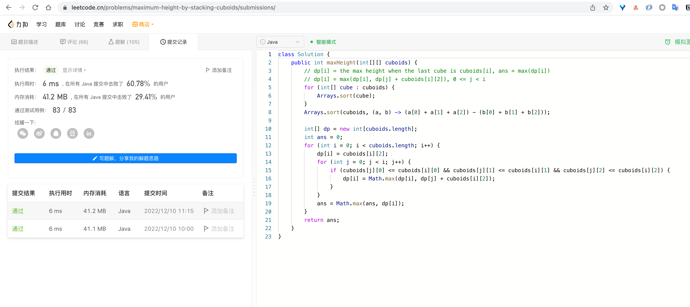

# Algorithm

# Review

[AWS announced a move from Xen towards KVM. So what is KVM?
](https://www.freecodecamp.org/news/aws-just-announced-a-move-from-xen-towards-kvm-so-what-is-kvm/)

# Tip

- [Use Openstack to manage private cloud](https://www.youtube.com/watch?v=_gWfFEuert8)
- [Use Devstack to install OpenStack](https://docs.openstack.org/devstack/latest/)

# Share

[eBPF介绍](https://coolshell.cn/articles/22320.html)