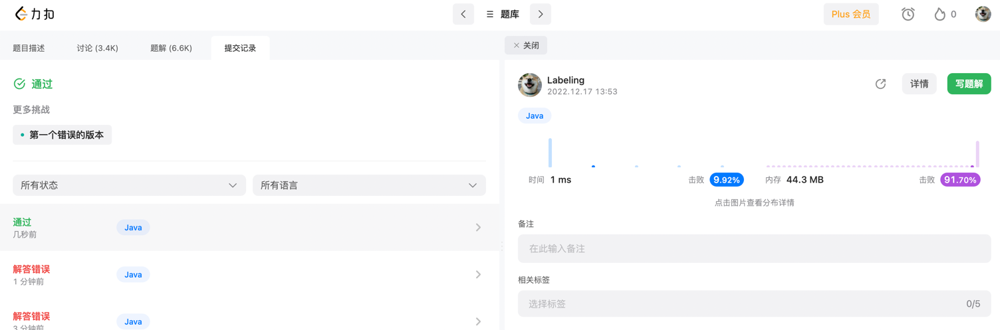

## Algorithm

## Review
[乐观悲观锁](https://www.couchbase.com/blog/optimistic-or-pessimistic-locking-which-one-should-you-pick/)
两种锁的适用场景
## Tip
idea 标记功能 
mac快捷键 ctl + shift + 数字键
标记后跳转标记代码 ctl + 数字键
## Share
使用可重入锁实现消费者生产者模型
```java
class ReentrantLockWithConditionUse {

    // 空间大小
    Stack<String> stack = new Stack<>();
    int CAPACITY = 5;

    ReentrantLock lock = new ReentrantLock();
    Condition stackEmptyCondition = lock.newCondition();
    Condition stackFullCondition = lock.newCondition();

    public void pushToStack(String item) throws InterruptedException {
        try {
            lock.lock();
            while(stack.size() == CAPACITY) {
                // 栈满 生产者等待
                stackFullCondition.await();
            }
            stack.push(item);
            // 通知等待的消费者消费
            stackEmptyCondition.signalAll();
        } finally {
            lock.unlock();
        }
    }

    public String popFromStack() throws InterruptedException {
        try {
            lock.lock();
            while(stack.size() == 0) {
                // 栈空 消费者等待
                stackEmptyCondition.await();
            }
            return stack.pop();
        } finally {
            // 通知生产者生产
            stackFullCondition.signalAll();
            lock.unlock();
        }
    }
}
```
使用客户端client
```java
public static void main(String[] args) throws InterruptedException {
    System.out.println("hello");
    ReentrantLockWithConditionUse reentrantLockWithConditionUse = new ReentrantLockWithConditionUse();
    reentrantLockWithConditionUse.pushToStack("xxxxxx");
    System.out.println(reentrantLockWithConditionUse.popFromStack());
    // 等待 可以多线程启动同时消费生产模拟
    System.out.println(reentrantLockWithConditionUse.popFromStack());
}
```


