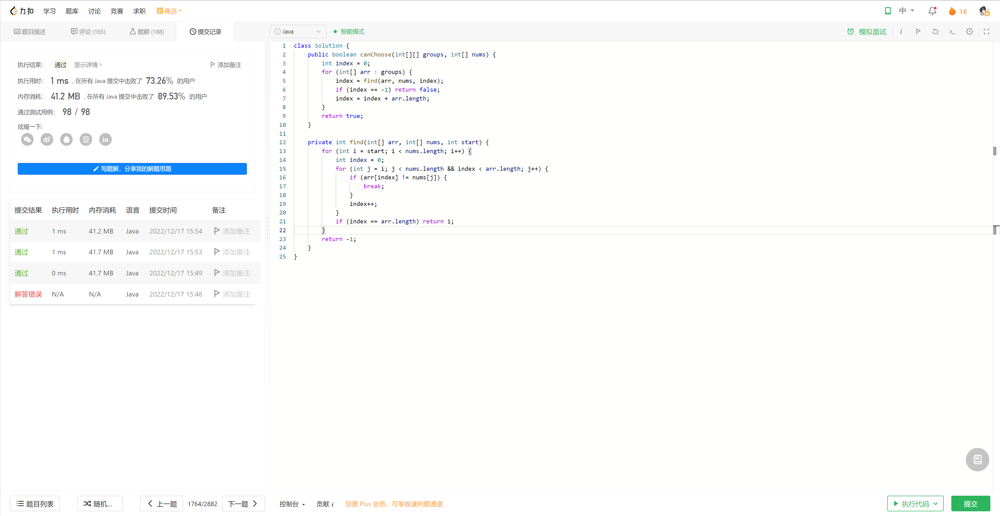
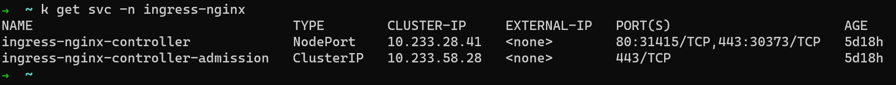

# Algorithm

# Review

[Ingress](https://kubernetes.io/docs/concepts/services-networking/ingress/)
[Ingress Controller](https://kubernetes.io/docs/concepts/services-networking/ingress-controllers/)

Expose service by ingress and ingress controller in Kubernetes.

# Tip

Nginx ingress controller expose other services by its NodePort type Service, but the nginx ingress controller doesn't set default ingress class, it can be done by setting default ingress class in Ingress Object definition or IngressClass Object definition.

# Share
[10x程序员是如何思考的？](https://time.geekbang.org/column/article/74471)

- 一个思考框架
    - 现状
    - 目标
    - 实现路径
- 四个思考原则
    - 以终为始
    - 任务分解
    - 沟通反馈
    - 自动化

面对问题时，用思考框架问问自己，现状、目标和路径。