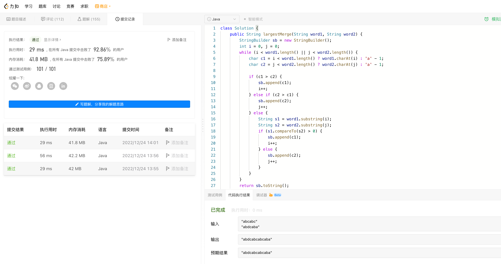

# Algorithm

# Review

[What is VXLAN](https://www.juniper.net/us/en/research-topics/what-is-vxlan.html)

Implementing virtual network with VXLAN over VMs or containers, to support network access between VMs or containers.

# Tip

无

# Share

[Flannel VXLAN](https://zhenran.notion.site/Flannel-VXLAN-a2906e8f0c4049f7bae12ca73eec5552)