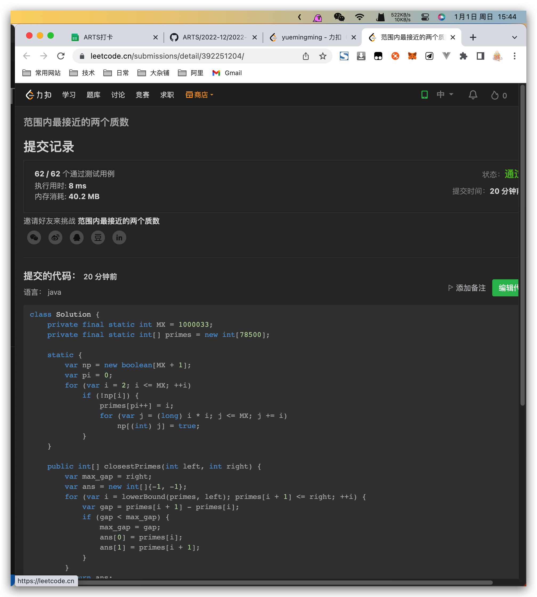

## Algorithm

# Review

[How I design software](https://medium.com/@hnasr/how-i-design-software-6a08f10d5c99)
一种软件设计的路径，通过一步一步书写各种文档，逐渐将一个软件整体描述出来。

# Tips

无
# Share

[如何阅读一本书](https://www.notion.so/qingming/f638fd7fd6854611a174f5fb4e15676b)
