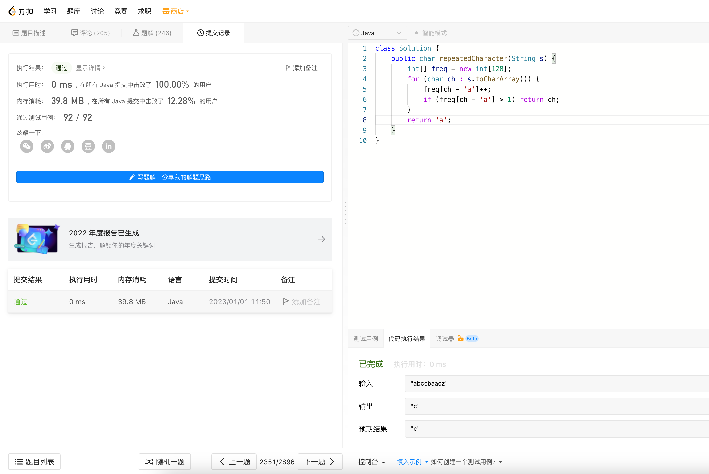

# Algorithm

# Review

[Git database internals I: packed object store](https://github.blog/2022-08-29-gits-database-internals-i-packed-object-store/)

# Tip

无

# Share

[Golang defer实现原理总结](https://zhenran.notion.site/Golang-defer-c0f50969601b462188e533245c6c5208)