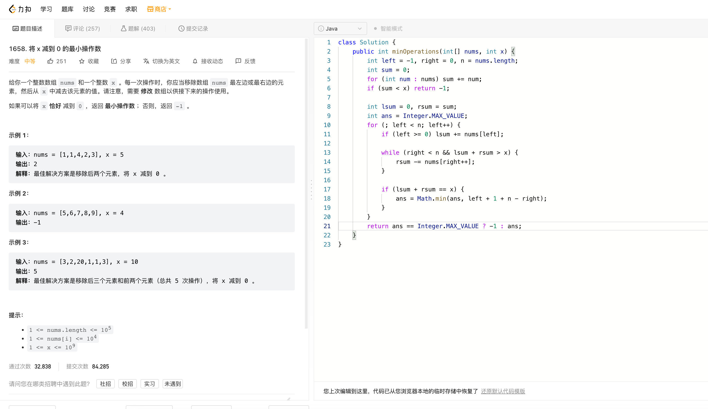

# Algorithm

# Review

[Git's database internals II: commit history queries](https://github.blog/2022-08-30-gits-database-internals-ii-commit-history-queries/)

# Tip

无

# Share

[Golang panic & recover 实现原理总结](https://zhenran.notion.site/Golang-panic-recover-6f770a6389c348abab0b8dc8ae0f0116)