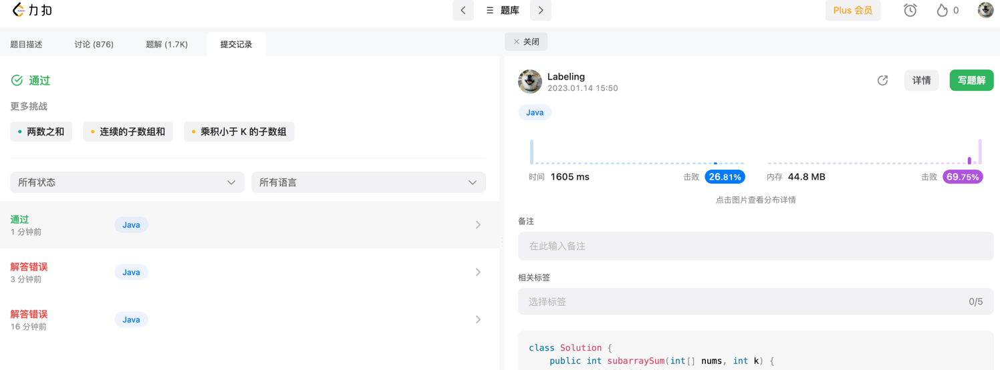

## Algorithm

* 第一个循环从位置开始
* 第二个循环子数组
## Review
[可变类型与不可变类型](https://www.tiny.cloud/blog/mutable-vs-immutable-javascript/)
* 不可变无法更改，返回新的copy
* 可变类型，直接在原数组上进行修改，不利于维护，编程快
## Tip
* 多行编辑（notepad++）`alt + shift`
* mac idea 多行编辑 `alt` + 鼠标左键

## Share
js在工作中如果处理批量前端数据可以直接在前端通过fetch数据+掉接口批量处理
### fetch 数据筛选
知乎 fetch 结果并且筛选14 条进行console.log
```javascript
resJson = await fetch("",{
}).then(r=>r.json());
// 过滤数据
xx = resJson.data.filter((x)=>x.index==14)
// 组装新curl
```
### 基本使用
```javascript
https://zh.javascript.info/async-await
js 简单使用
* async 异步，可以传递引用函数: f().then(console.log)
* 可以await直接调用: await f()
* 等待3s: // 等待 3 秒 await new Promise((resolve, reject) => setTimeout(resolve, 3000));
async function showAvatar() {
  // 读取我们的 JSON
  let response = await fetch('/article/promise-chaining/user.json');
  let user = await response.json();

  // 读取 github 用户信息
  let githubResponse = await fetch(`https://api.github.com/users/${user.name}`);
  let githubUser = await githubResponse.json();

  // 显示头像
  let img = document.createElement('img');
  img.src = githubUser.avatar_url;
  img.className = "promise-avatar-example";
  document.body.append(img);

  // 等待 3 秒
  await new Promise((resolve, reject) => setTimeout(resolve, 3000));

  img.remove();

  return githubUser;
}
showAvatar();
```
