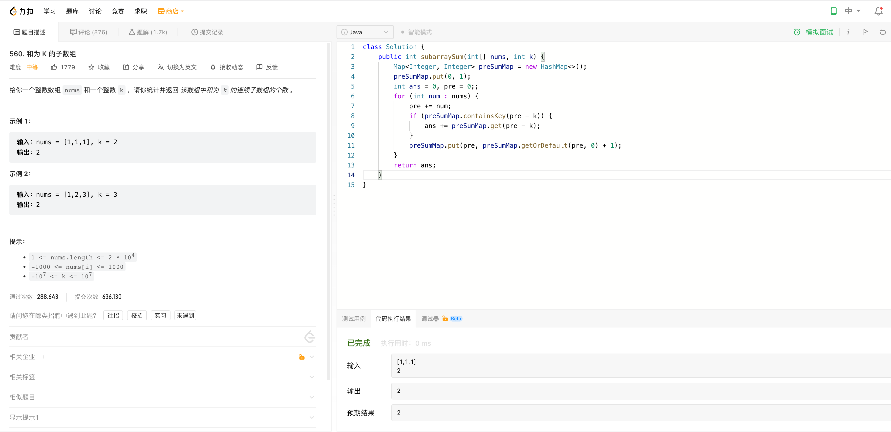

# Algorithm

# Review

[Kubernetes Custom Resources](https://kubernetes.io/docs/concepts/extend-kubernetes/api-extension/custom-resources/)

# Tip

无

# Share

[Golang select实现原理总结](https://zhenran.notion.site/Golang-select-51effce3f4e54e54a0537eefb5c85f54)