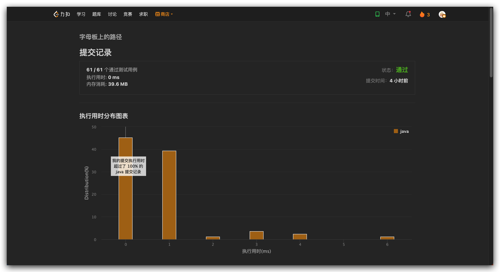

## Algorithm

# Review

[API First: The New Way of Developing Software](https://medium.com/better-programming/api-first-the-new-way-of-software-development-1ecd8db4594)

在开发过程中，为什么要 API 定义先行，有什么好处，如何去实现，以及一些 API 自动化的一些工具。

* 前期聚焦 API，理清交互，避免后续开发过程中变更
* API 定义完成之后，消费方和生产方都可以基于 API 并行开发

# Tips
https://github.com/btraceio/btrace
一个安全，动态的 Java 应用运行时追踪工具。大部分功能和 ARTHAS 是重合的，使用体验上，感觉 ARTHAS 更好一些。开箱即用，配合 IDEA 的工具，很容易就能定制化各种需求。但是 Btrace 需要写脚本，略微麻烦。

# Share
