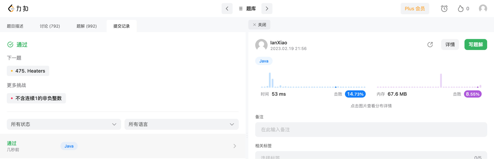

## Algorithm

# Review

https://www.inovex.dede/blog/rust-vs-go-vs-c-vs-kotlin/

对比Rust、Go、C#、Kotlin的相关http框架的性能。

# Tips

使用[Charles](https://www.charlesproxy.com/overview/about-charles/)能够实现对http通信的拦截，可以查验Request和Response参数。
Charles工作的大致原理:
1. 在本机启动一个网络代理（proxy），所有对外的通信都必须走这个代理；
2. Charles监听经过这个代理的通信；
3. 通过设置相关的断点，用户可以拦截特定的请求或回复；
4. 拦截之后，可以编辑这些请求或回复。

# Share

https://www.smashingmagazine.com/2016/09/understanding-rest-and-rpc-for-http-apis/

- 在构建API时，REST和RPC是两种最常用的方式，理解他们有助于选择。
- REST代表“**RE**presentational **S**tate **T**ransfer”，REST描述了server和client的关系，server数据通过JSON/XML等简单格式的形式提供，REST有一些限制：
    - REST必须是无状态的：不保留请求之间的会话；
    - 响应应声明可缓存性：当客户端遵守API是否可缓存的声明时，有助于API的伸缩性；
    - REST专注于一致性：如果使用HTTP，应尽可能使用HTTP功能，而不是发明协议。
- RPC代表远程过程调用，本质上和调用JavaScript、PHP、Python等中的函数相同，采用方法名和参数。
- 基于RPC的API非常适合操作（即实现过程和命令）；基于REST的API非常适合对domain（即资源和实体）进行建模，是CRUD可用于所有数据。