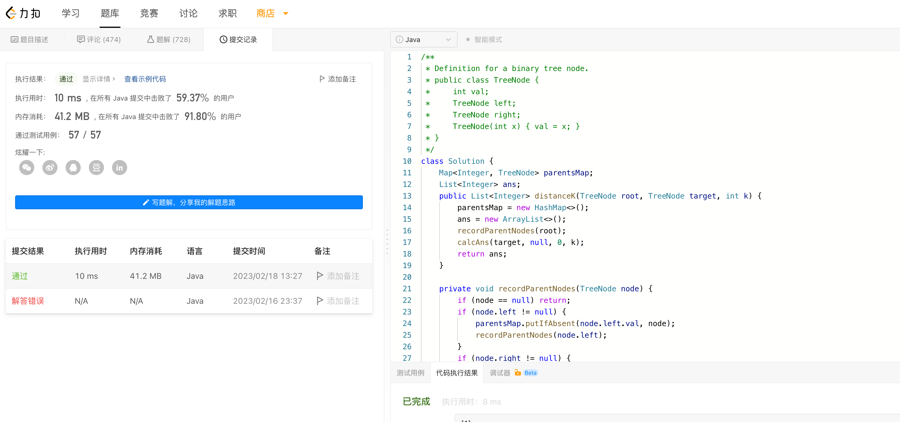

# Algorithm

# Review

[Pod Disruptions](https://kubernetes.io/docs/concepts/workloads/pods/disruptions/)

# Tip

redigo 连接 Redis 哨兵集群：https://github.com/FZambia/sentinel/blob/master/sentinel.go

获取连接前，先连接到哨兵节点，获取 master 地址后再连接到主节点。过程比较耗时，需要配置好连接池，设置一定的 Idle 连接数量。

# Share
