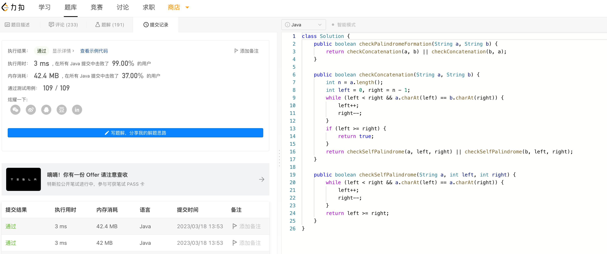

# Algorithm

# Review

[PSI Files in Jetbrains plugin](https://plugins.jetbrains.com/docs/intellij/psi-files.html)

# Tip

[Goland单测插件](https://github.com/dougsong/golang-ut-gen)，自动生成单元测试模板

# Share
