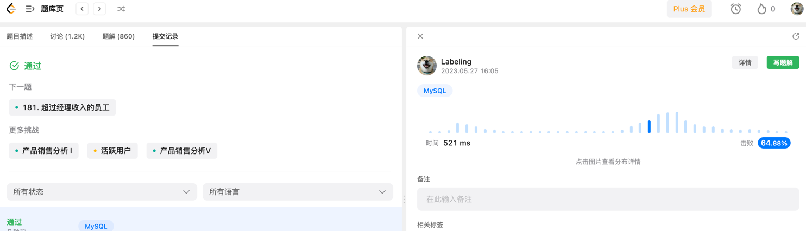

## Algorithm



* 使用in查询

## Review

[System Design](https://medium.com/@olgamitroshyna/software-architecture-i-wish-i-had-known-about-this-earlier-4df43eae57db)

## Tip
Spring 注入@Value 注入map
多租户需要两套环境，可以通过@Value注入Map
### 代码
```java
@Value("#{${spring.mysql.ip}}")
private Map<String,String> map;
// properties
spring.mysql.ip={dev: "127.0.0.1:3306",prod: "192.168.31.321:3306"}
```
### 输出
map{dev=127.0.0.1:3306, prod=192.168.31.321:3306}
## Share
