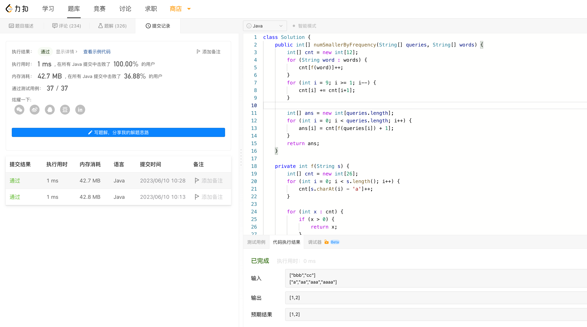

# Algorithm

# Review

[Deep dive into Linux Networking and Docker — bridge, veth and iptables](https://medium.com/techlog/diving-into-linux-networking-and-docker-bridge-veth-and-iptables-a05eb27b1e72)

# Tip

# Share

[Crossplane 云原生控制平面](https://www.zhenran.me/posts/crossplane/)