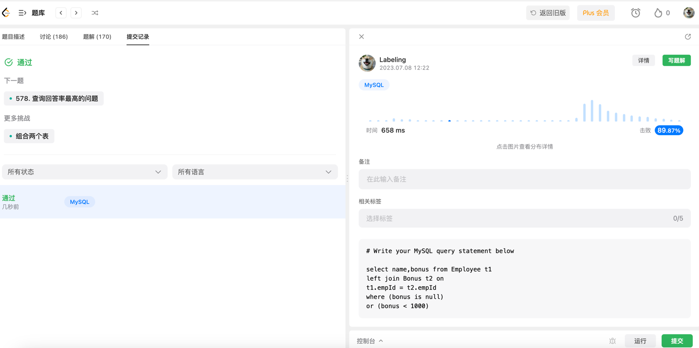

## Algorithm

## Review

[软技能](https://medium.com/gitconnected/to-be-a-great-software-developer-you-need-a-system-d4f461658743)

- 使用todolist
- 专注开发时间
- 专注Have a Rest时间

## Tip

## Share
java 锁
[synchronized](https://www.cnblogs.com/woshimrf/p/java-synchronized.html)
synchronized关键字
* 锁方法，针对实例
* 锁静态方法，针对类
* 锁Class，针对类
方便资源的静态访问
