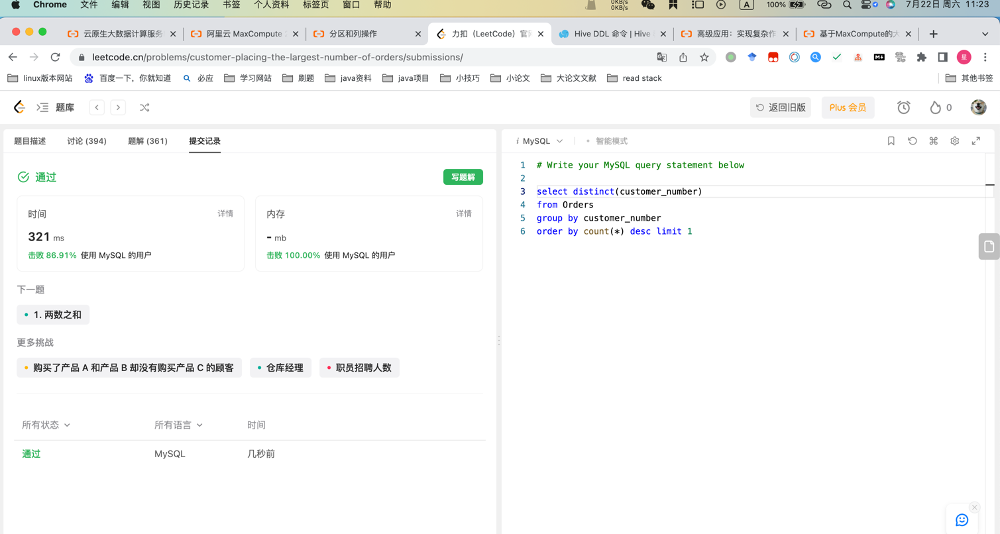

## Algorithm


* 简单mysql查询

## Review

[Spring实践](https://medium.com/@raviyasas/spring-boot-best-practices-for-developers-3f3bdffa0090)

<?xml version="1.0" encoding="" ?>>
单独版本控制
Controller只做路由
Always try to write simple, readable codes.
The same simple logic can be implemented using different ways, but it is difficult to understand if it is not readable or understandable.
Sometimes complex logic consumes more memory.
Try to use KISS, DRY, and SOLID principles when writing codes. I will explain this in a future article.x

## Tip


## Share
Hive 建表语句
```mysql
CREATE [EXTERNAL] TABLE [IF NOT EXISTS] table_name
　　[(col_name data_type [COMMENT col_comment], ...)]
　　[COMMENT table_comment]
　　[PARTITIONED BY (col_name data_type [COMMENT col_comment], ...)]
　　[CLUSTERED BY (col_name, col_name, ...)
　　　　[SORTED BY (col_name [ASC|DESC], ...)] INTO num_buckets BUCKETS]
　　[ROW FORMAT row_format]
　　[STORED AS file_format]
　　[LOCATION hdfs_path]
```
支持行格式
```mysql
ROW FORMAT
　　DELIMITED [FIELDS TERMINATED BY char] [COLLECTION ITEMS TERMINATED BY char]
　　　　MAP KEYS TERMINATED BY char] [LINES TERMINATED BY char]
　　　　| SERDE serde_name [WITH SERDEPROPERTIES
　　　　(property_name=property_value, property_name=property_value, …)]
```
用户在建表的时候可以自定义 SerDe 或者使用自带的 SerDe。如果没有指定 ROW FORMAT 或者 ROW FORMAT DELIMITED，将会使用自带的 SerDe。在建表的时候，用户还需要为表指定列，用户在指定表的列的同时也会指定自定义的 SerDe，Hive 通过 SerDe 确定表的具体的列的数据。
