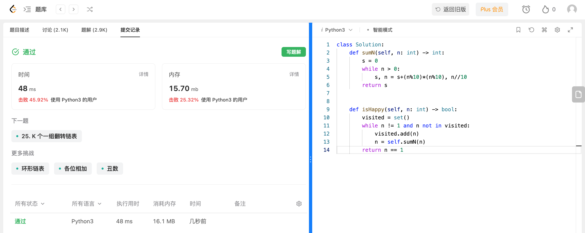

## Algorithm

# Review

[BoxDiff](https://arxiv.org/pdf/2307.10816v2.pdf)

https://github.com/sierkinhane/boxdiff

现有图像生成主要研究只使用文本提示合成图像，很少有使用其他形式，比如盒子或草图。BoxDiff提供了一种通过给定的空间条件控制合成图像中的对象和背景的方式来生成图像。

# Tips

# Share
