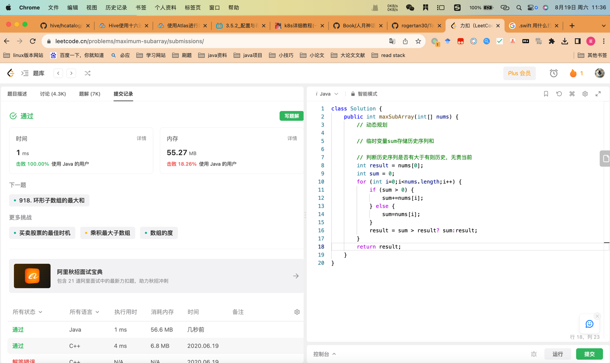

## Algorithm


* sum 累和 判断是否有增益
* 跟result进行判断取大小
* dp[i]=max{nums[i],dp[i−1]+nums[i]}

## Review

[一些简单技巧提升代码可读性](https://medium.com/javarevisited/java-best-practices-for-writing-clean-and-professional-code-6b575ce224f)

## Tip


## Share

k8s config map，configmap支持热更新。
k8s 用描述性yaml创建pod。管理pod。

```yaml
apiVersion: v1
kind: Namespace
metadata:
  name: dev
---
apiVersion: v1
kind: Pod
metadata:
  name: nginxPod
  namespace: dev
spec:
  containers:
  - name: nginx-containers
    image: nginx:latest
```

