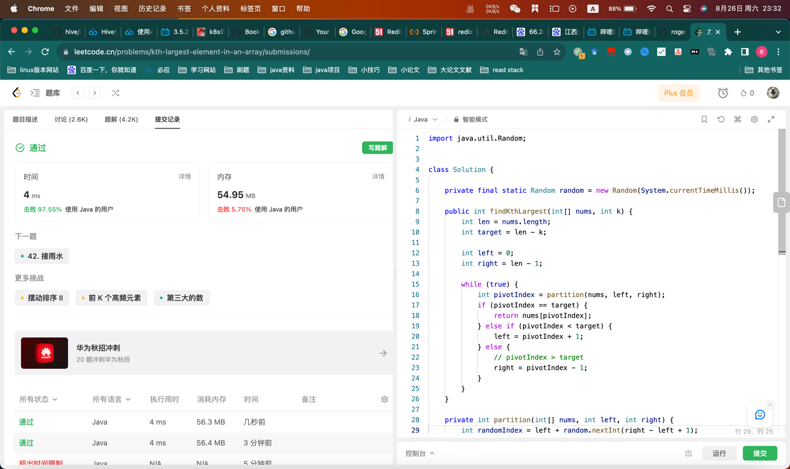

## Algorithm



## Review

[rate limit](https://medium.com/geekculture/system-design-design-a-rate-limiter-81d200c9d392)

## Tip
json 自定义反序列化
简单demo

```java
package com.hx;

import com.fasterxml.jackson.core.JsonParser;
import com.fasterxml.jackson.core.JsonProcessingException;
import com.fasterxml.jackson.databind.DeserializationContext;
import com.fasterxml.jackson.databind.JsonNode;
import com.fasterxml.jackson.databind.annotation.JsonDeserialize;
import com.fasterxml.jackson.databind.deser.std.StdDeserializer;
import com.fasterxml.jackson.databind.json.JsonMapper;
import com.fasterxml.jackson.databind.node.IntNode;
import lombok.AllArgsConstructor;
import lombok.Data;
import lombok.NoArgsConstructor;
import org.junit.Assert;
import org.junit.Test;

import java.io.IOException;
import java.text.SimpleDateFormat;
import java.time.format.DateTimeFormatter;
import java.util.Date;
import java.util.Locale;

/**
 * 杰克逊deseri
 *
 * @author kyle
 * @date 2023/08/26
 */
public class JacksonDeseri {

    @Data
    @AllArgsConstructor
    @NoArgsConstructor
    @JsonDeserialize(using = RecordDeserializer.class)
    static class Record {

        private Long id;
        private String message;
        private Date timestamp;
    }

    @Test
    public void testPrint() throws JsonProcessingException {
        Record record = new Record(1L, "测试", new Date());
        JsonMapper jsonMapper = new JsonMapper();
        SimpleDateFormat dateFormat = new SimpleDateFormat("yyyy-MM-dd");
        jsonMapper.setDateFormat(dateFormat);
        System.out.println(jsonMapper.writeValueAsString(record));
        Assert.assertEquals(jsonMapper.writeValueAsString(record),"{\"id\":1,\"message\":\"测试\",\"timestamp\":\"2023-08-26\"}");
    }

    @Test
    public void testDeserialize() throws JsonProcessingException {
        JsonMapper jsonMapper = new JsonMapper();
        String xx = "{\"id\":1,\"message\":\"测试\",\"timestamp\":\"2023-08-26\"}";
        Record record = jsonMapper.readValue(xx, Record.class);
        System.out.println(record);
    }

    static class RecordDeserializer extends StdDeserializer<Record> {

        private static DateTimeFormatter dtf
                = DateTimeFormatter.ofPattern("yyyy-MM-dd hh:ss:mm a z", Locale.US);

        public RecordDeserializer() {
            this(null);
        }

        public RecordDeserializer(Class<?> vc) {
            super(vc);
        }

        @Override
        public Record deserialize(JsonParser parser, DeserializationContext ctx)
                throws IOException {

            JsonNode node = parser.getCodec().readTree(parser);
            Integer id = (Integer) ((IntNode) node.get("id")).numberValue();
            String message = node.get("message").asText();
            String timestamp = node.get("timestamp").asText();
            return new Record(id.longValue(), message, new Date());
        }
    }
}

```

## Share
