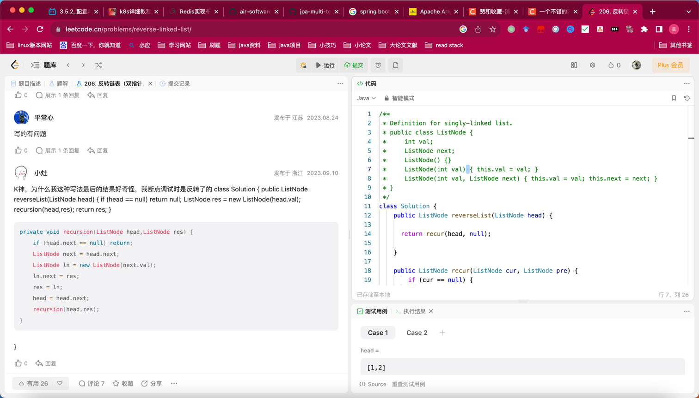

## Algorithm

* 递归模板
* recur(cur , pre)
* 递归时缩小规模res = recur(cur.next, cur);
* 回溯 cur.next = pre;
* return res;

## Review

[pyarrow](https://blog.det.life/apache-arrow-the-future-of-data-engineering-83abf87557da)

## Tip

## Share
Cloudera manager API
[cloudera](https://archive.cloudera.com/cm7/7.2.4/generic/jar/cm_api/swagger-html-sdk-docs/java/README.html)
官方api