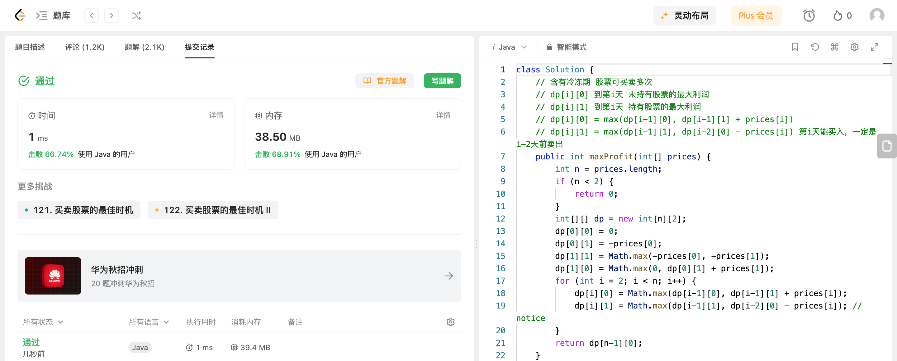

## Algorithm

# Review

[BEVGPT: Generative Pre-trained Large Model for Autonomous Driving Prediction, Decision-Making, and Planning
](https://arxiv.org/pdf/2310.10357.pdf)

[CityDreamer](https://infinitescript.com/project/city-dreamer)

 BEVGPT 是第一个生成式, 集预测、决策、运动规划于一体的自监督 pre-trained的大模型。输入BEV images,  输出自车轨迹, 并且能够输出对驾驶场景的预测,  该方案训练时需要高精地图。

# Tips

# Share
