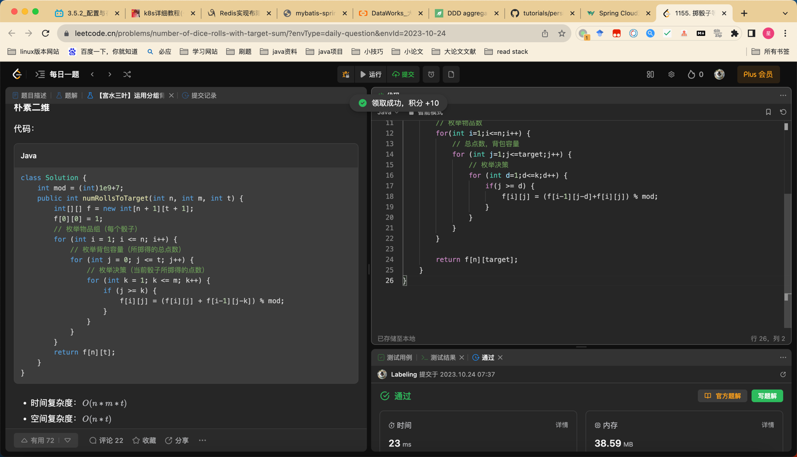

## Algorithm

* 背包问题
* 状态转移 i 为第几个骰子，j为target分数，f 0 0 = 1, f(i,j) = ∑f(i-1,j-target)[j>=target];
## Review

[微服务间消息传递](https://medium.com/@dip-mazumder/java-microservices-architecture-inter-service-communication-use-cases-7d1d31b2617)

## Tip

通过写脚本批量curl来完成批量操作。

## Share
