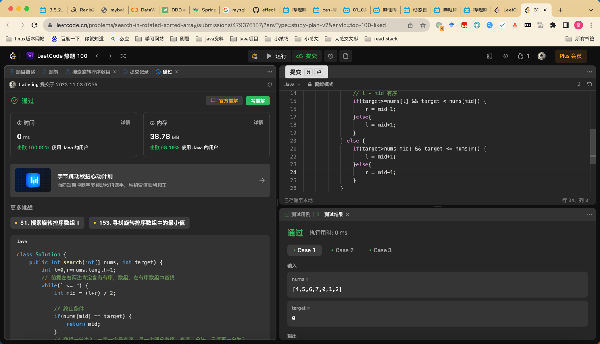

## Algorithm
rotate

定理一：只有在顺序区间内才可以通过区间两端的数值判断target是否在其中。
定理二：判断顺序区间还是乱序区间，只需要对比 left 和 right 是否是顺序对即可，left <= right，顺序区间，否则乱序区间。
定理三：每次二分都会至少存在一个顺序区间。
通过不断的用Mid二分，根据定理二，将整个数组划分成顺序区间和乱序区间，然后利用定理一判断target是否在顺序区间，如果在顺序区间，下次循环就直接取顺序区间，如果不在，那么下次循环就取乱序区间。

## Review

[uber设计](https://medium.com/@karan99/system-design-uber-33593137a4fe)

- 设计行为
- 设计库表
- 计算访问量
- 计算存储量
- 微服务划分服务
- 梳理用户故事

## Tip

DDD 业务建模梳理用户故事

一个故事为一张看板卡。

故事细分为 
活动
（一组任务）
任务
（API基本的函数，动词+名词）
命令
（函数内部细节状态组合，业务变盘）

## Share
