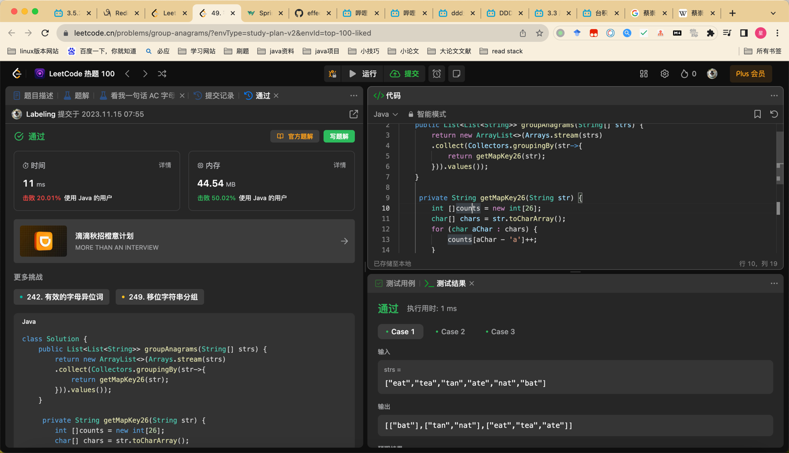

## Algorithm



- 数组，第一位排序字母，第二位出现的次数
- 数组转String放到Map
- i+'a' 转换字母
- 26位counts计数。下标代表字母。
```java
private String getMapKey26(String str) {
        int []counts = new int[26];
        char[] chars = str.toCharArray();
        for (char aChar : chars) {
            counts[aChar - 'a']++;
        }
        
        // aab ab

        StringBuilder sb = new StringBuilder();
        for (int i = 0; i < counts.length; i++) {
            if (counts[i] > 0) {
                sb.append((char) (i+'a')).append(counts[i]);
            }
        }
        return sb.toString();
    }
```
## Review

[oauth2.0 turial](https://www.digitalocean.com/community/tutorials/an-introduction-to-oauth-2)

## Tip


## Share

[mysql int11作用](https://editor.csdn.net/md/?articleId=134449059)
