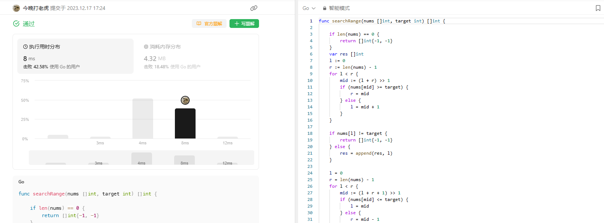

# Algorithm

# Review

[Request Pipeline - Improve latency by sending multiple requests on the connection without waiting for the response of the previous requests.](https://martinfowler.com/articles/patterns-of-distributed-systems/request-pipeline.html)

# Tip

无

# Share
