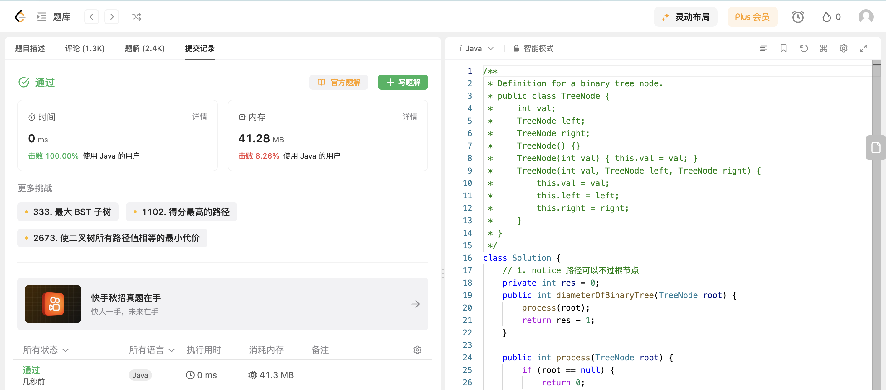

## Algorithm

# Review

[EditGuard: Versatile Image Watermarking for Tamper Localization and Copyright Protection](https://arxiv.org/pdf/2312.08883.pdf)

[EditGuard](https://github.com/xuanyuzhang21/EditGuard)

AI图像生成模型已经能够制作出十分逼真且令人惊叹的图像，这给摄影师和图像编辑这的工作带来了极大的便利。然而他们也给版权保护和信息安全方面带来了新的挑战。因此有效的版权保护和篡改定位技术是维护图像信息可信度、安全度的关键。这篇文章设计了一种多功能主动取证方法，以一种不可见的方式向原始图像中添加定位水印和版权水印，使他们互不干扰，最终得到一张被保护的容器图。

# Tips

# Share
