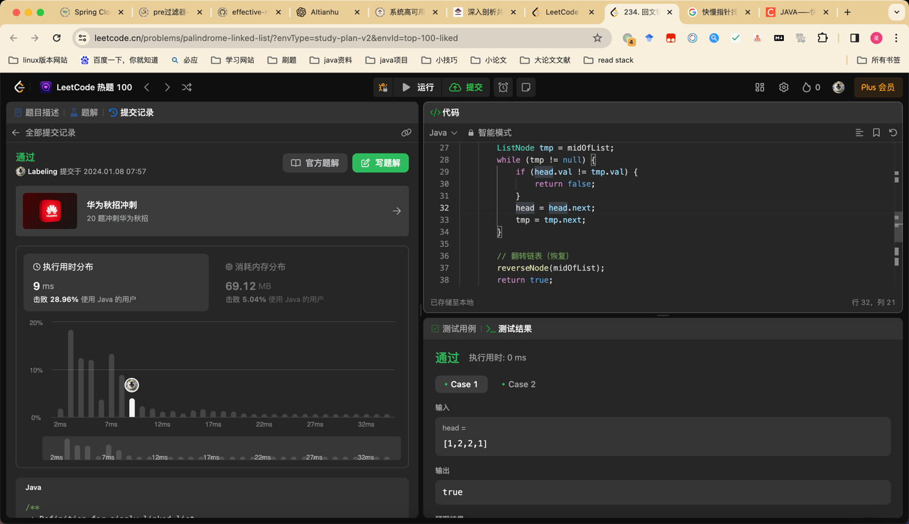

## Algorithm

### day01，回文链表
翻转链表 head.next.next=head.next heat.next=null head, last.
链表中点 (fast!=null fast.next!=null) slow=slow.next,fast = fast.next.next
### day02, 环形链表II
* fast!=null fast.next!=null 找到环形点。fast==slow break
* 从head 走到与 slow或者fast相遇为环形链表重叠点
### day03, 链表相加
构建模板，构建返回值。
* 递归模板伪代码
```java
ListNode add(l1, l2, bit) {
    // l1 l2 不为空
    l1 = l1.next; 
    l2 = l2.next;
    val += bit + l1 + l2;
    ListNode nodeForUpdate = new ListNode(val%10);
    nodeForUpdate.next = add(l1, l2, val/10);
    return nodeForUpdate;
}
```
## day05, 删除第n个节点




## Review

[k8s storage](https://medium.com/@seifeddinerajhi/understanding-storage-in-kubernetes-ee2c19001aae)

## Tip

Nginx Cookie
最近在搞前端部署nginx转发后端遇到的问题：
1 public path，通过nginx alias解决
2 跨域问题 nginx 级联 nginx 解决跨域问题

Nginx路径匹配：
/ 优先级最低，但是匹配所有兜底
/xx 优先匹配

## Share
