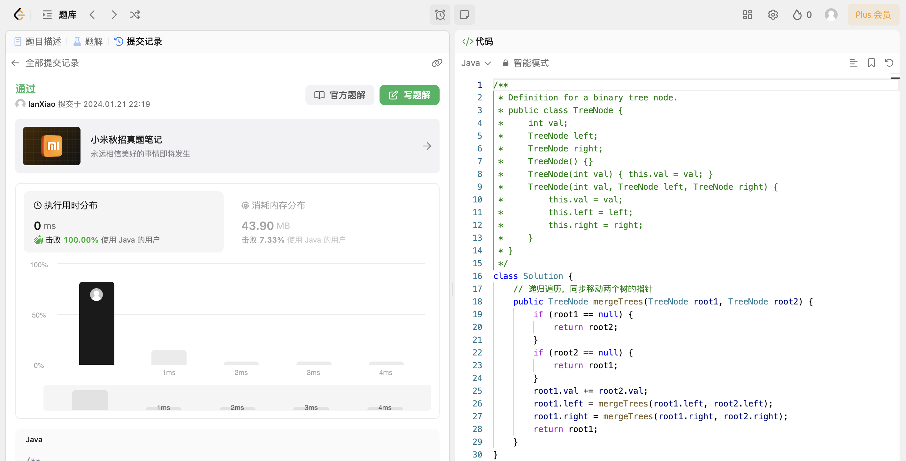

## Algorithm

# Review

[Solving olympiad geometry without human demonstrations](https://www.nature.com/articles/s41586-023-06747-5)

Google DeepMind的研究成果，一个能够以接近人类奥赛金牌得主的水平解决复杂几何问题的人工智能系统。在对30道奥数几何题的基准测试中，AlphaGeometry在标准奥数时限内解决了25道。相比之下，人类金牌得主平均解决25.9道。定理证明对于基于学习道AI模型困难程度很高，因为大多数数学领域中，翻译成机器可验证预言道人类证明训练数据都很少。DeepMind提出了一种使用合成数据进行定理证明道替代方法。

# Tips

# Share
