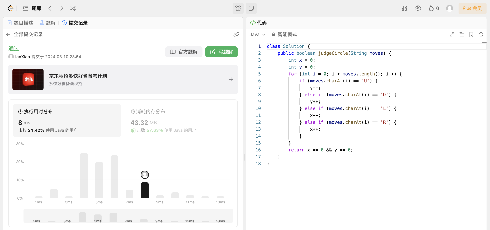

## Algorithm

# Review

[Small, Versatile and Mighty: A Range-View Perception Framework](https://arxiv.org/html/2403.00325v1)

激光雷达测距传感器在安全关键应用中发挥着至关重要的作用，可以在不考虑光照条件下提供精确的3D环境测量。然而，激光雷达点云本质上是非均匀、无序切稀疏的，这禁止了高度优化算子(如卷积)的直接应用。提出了一种在点云中建立邻域结构，通过半径搜索在局部邻域中应用卷积算子的方法。

# Tips

# Share
