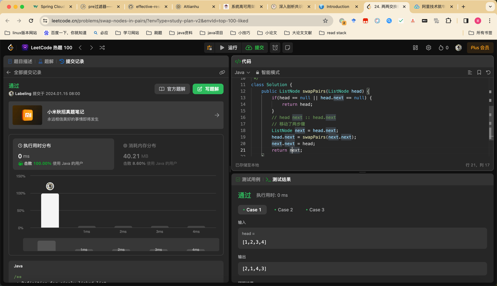

## Algorithm

### day01
* 146. LRU 缓存
* 数据结构：LinkedHashMap，Hash查找，Map删除
* makeRecently，int val = cache.get(key);,cache.removeKey, cache.put(key, val)

### day02
二叉树中序遍历

### day03
104. 二叉树的最大深度
* 递归子问题然后回溯
* 广度优先遍历

## Review

[k8s 架构](https://awstip.com/kubernetes-architecture-43d909850cbd)

## Tip

## Share