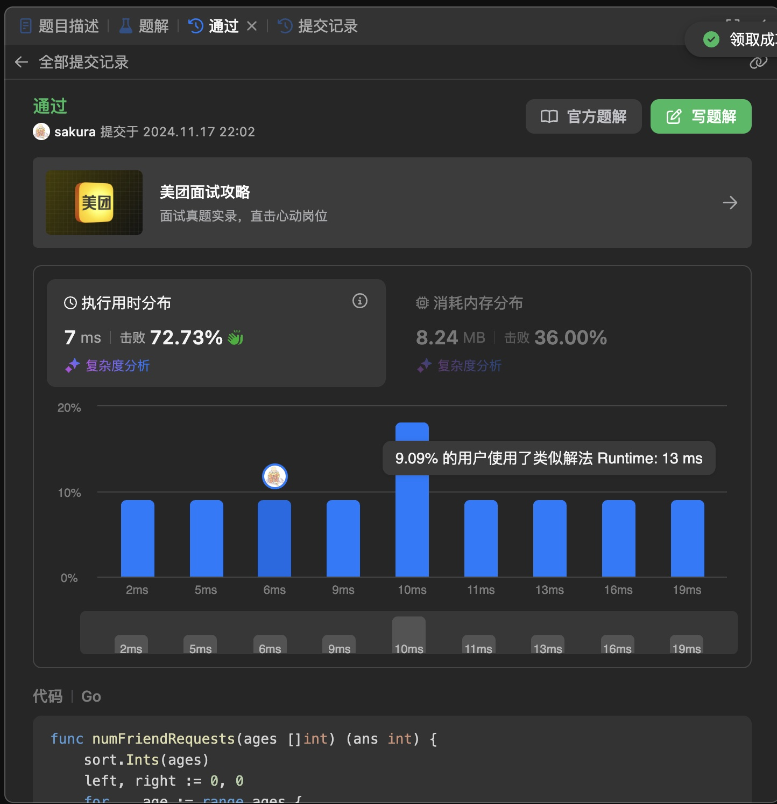

## Algorithm

# Review
[My Favourite Software Architecture Patterns](https://medium.com/gitconnected/my-favourite-software-architecture-patterns-0e57073b4be1)
作者描述了多种模式，并且简述了各个模式在什么场景下使用。但是各个模式之间的关系并不是那么清晰和明确。
有的模式是在软件建模的过程中使用。有的是软件基础组件的模式，有的是软件实现的模式，有的是前端，有的是后端。。。

# Tips
无

# Share
无 