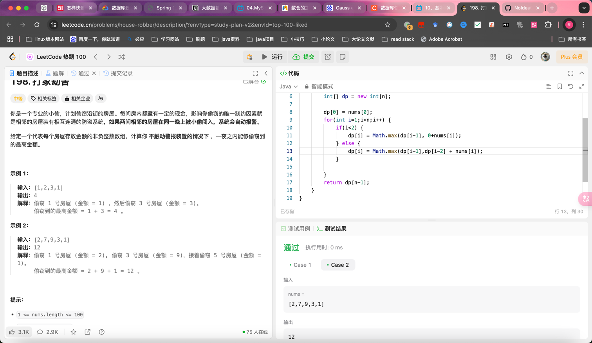
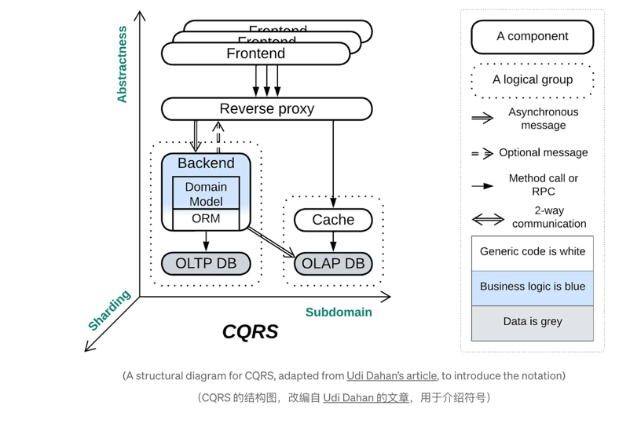

## Algorithm

- 动态规划
- 状态转移 dp[n+1]=max(dp[n],dp[n−1]+num)
## Review

[Architectural Metapatterns](https://itnext.io/architectural-metapatterns-1834bdbc4221?gi=b795d9457e76&ref=dailydev)

元模式
## Tip

## Share
