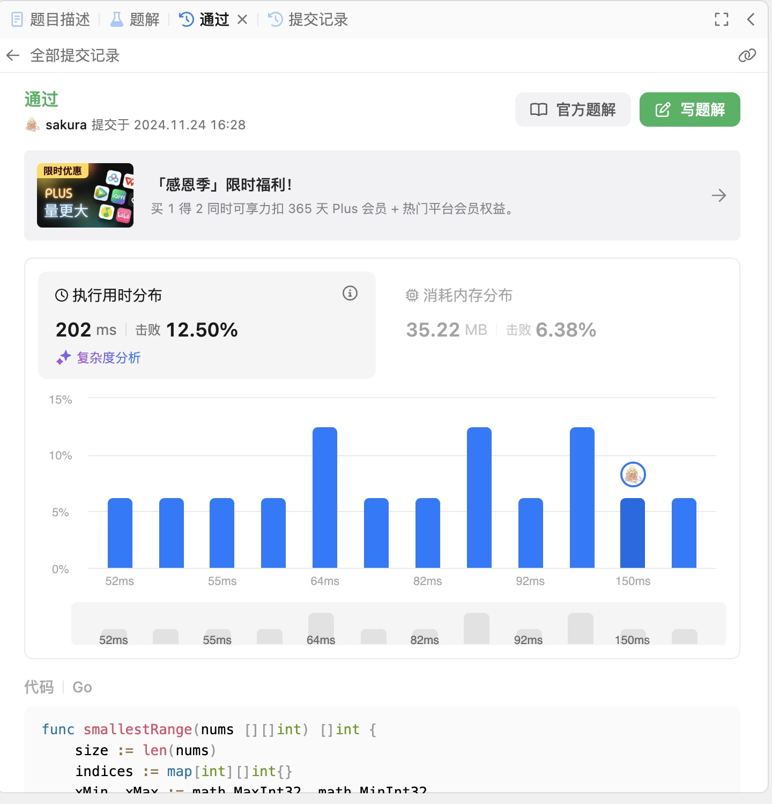

# Algorithm

## Review

[How a Google engineer became staff at the age of 28 only](https://medium.com/write-a-catalyst/how-a-google-engineer-became-staff-at-the-age-of-28-only-06991ff54134)
本质的逻辑是将时间花费在有更大产出更大影响的事情上，学会拒绝某些低产出的工作。但是要控制一个量，避免成为团队中不合群的人。

## Tips

无

## Share

无
