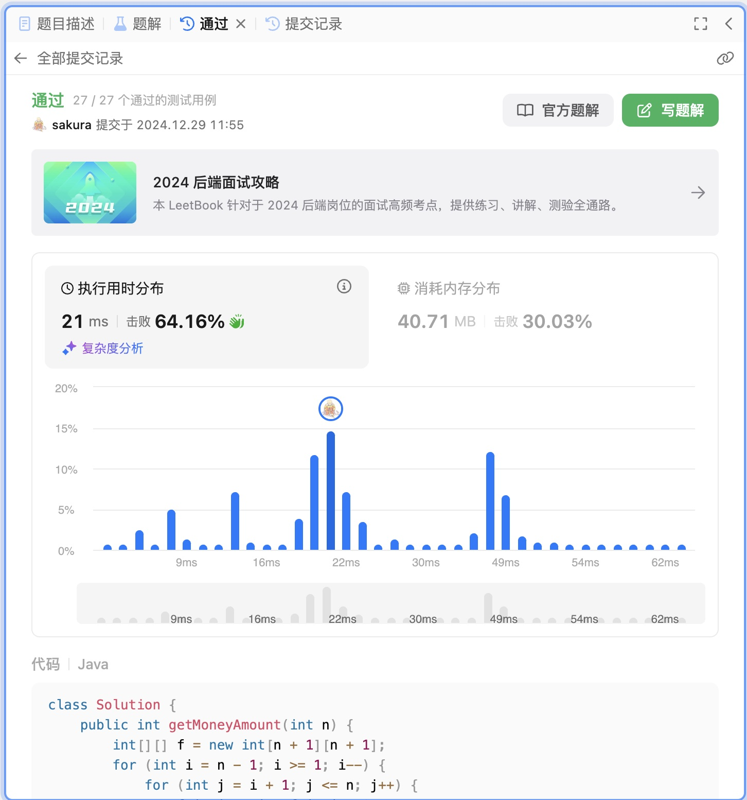

# Algorithm

## Review

[10 Things Software Developers Should Learn about Learning](https://cacm.acm.org/research/10-things-software-developers-should-learn-about-learning/)

两个点：
1. 知识是需要去学习的，对于某些知识虽然互联网唾手可得，但如果你不知道，你就不会用他来解决问题。
2. 学习底层知识，在构建解决方案时，才有足够的负载去解决更高层次的问题。

## Tips

无

## Share

无
