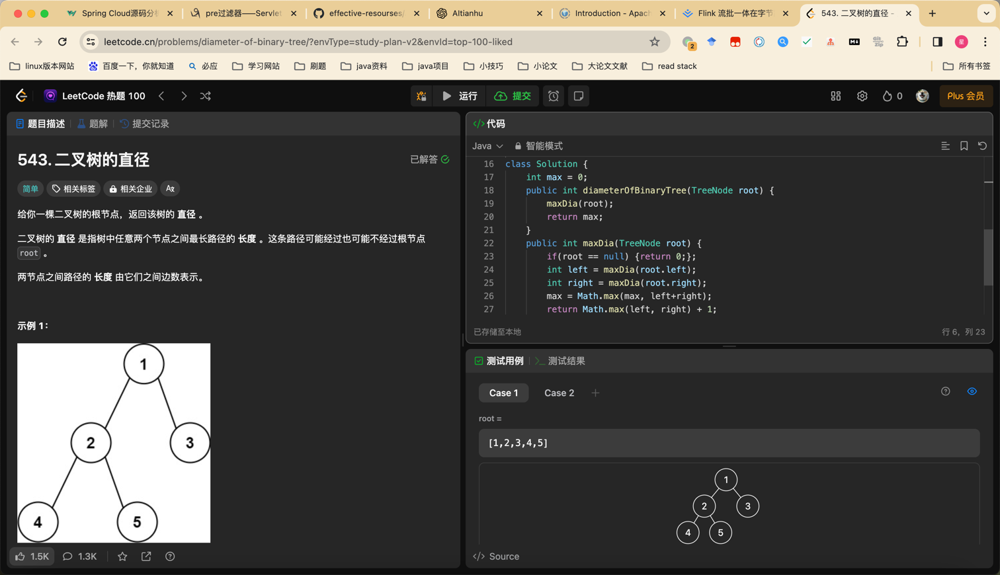

## Algorithm

### day01 二叉树的直径
- 二叉树的直径为，所有节点的左子树+右子树高度中的最大值。

### day03 二叉树的层序遍历 
- 使用Queue完成。poll加add所有子节点。ArrayQueue

### day04 构建完全二叉树
- 终止条件 left > right
- 递归代码，return root，构建左子树，构建右子树

## Review

[事件驱动](https://dev.to/yokwejuste/understanding-event-driven-architecture-110o?ref=dailydev)

## Tip

- mysql case when 支持重命名
- mysql支持复杂嵌套

## Share
