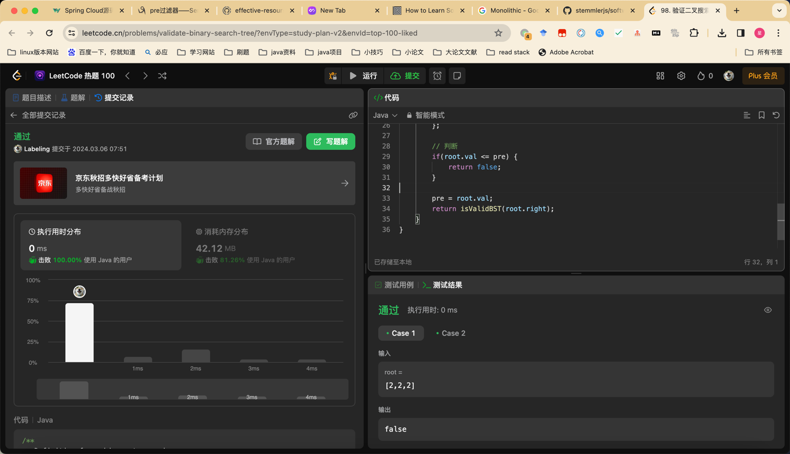

## Algorithm

### day01 完全二叉树
- 完全二叉树中序遍历，一定有序

## Review

[程序员成长之路](https://khalilstemmler.com/articles/software-design-architecture/full-stack-software-design/)
- 从CleanCode到DDD一些列介绍

## Tip

## Share
JS
- Promise 消费者等待 生产者
- Async 快速Promise
- Await 快速获取Promise结果
