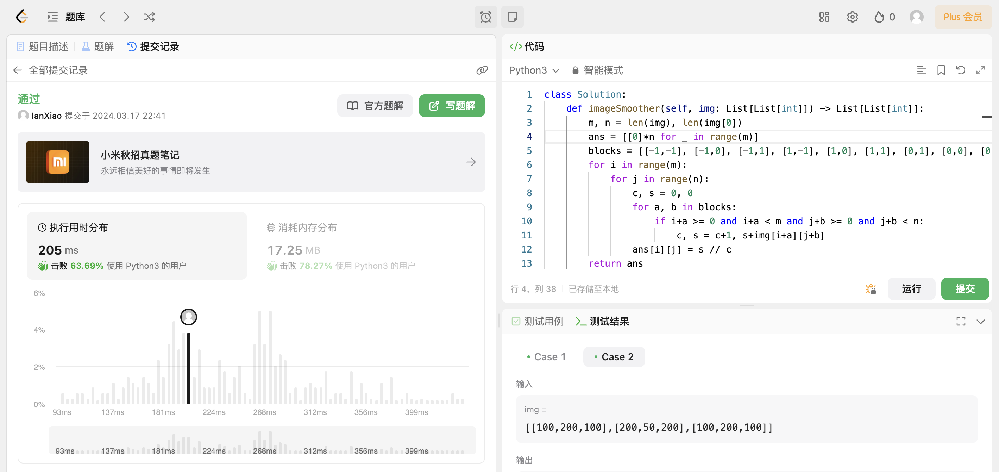

## Algorithm

# Review

[One-dimensional Adapter to Rule Them All: Concepts, Diffusion Models and Erasing Applications](https://arxiv.org/abs/2312.16145)

[Concept Semi-Permeable Membrane](https://lyumengyao.github.io/projects/spm)

Concept Semi-Permeable Membrane (概念半透膜模型, SPM模型) 能够在 Diffusion 架构的 AI 作图模型中，精准、可控地擦除各类具象或抽象概念，并对无关概念做到几乎完全保留。

主流的视觉 AIGC 基于扩散模型（Diffusion Model），但依然存在各类问题，比如可以被诱导生成涉黄、侵权等危险概念、无法精准地对某些概念进行作画和控制等。外置安全系统拦截风险会造成较差的用户体验（无恶意用户因模型偶然生成的一些违规内容而被拦截），因此需要一种基于模型内生成安全概念擦除方法，保留用户意图，同时对模型违规元素进行柔性地精准擦除。

# Tips

# Share
