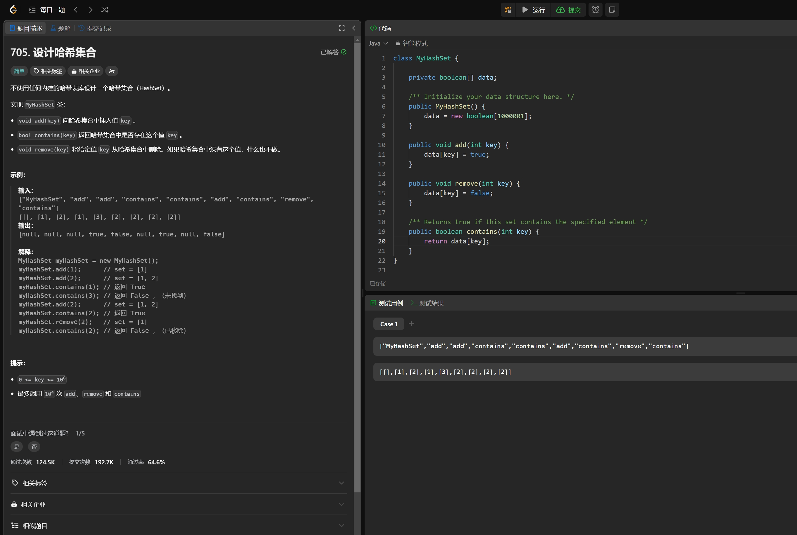

# Algorithm

# Review

[How does Uber build real-time infrastructure to handle petabytes of data every day?](https://medium.com/data-engineer-things/how-does-uber-build-real-time-infrastructure-to-handle-petabytes-of-data-every-day-ddf5fe9b5d2c)

# Tip

# Share
