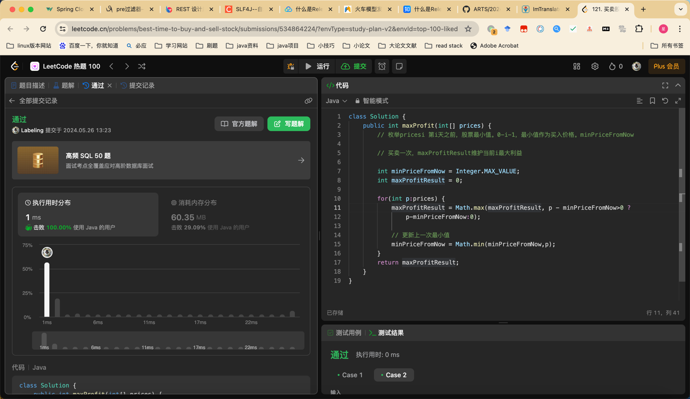

## Algorithm

* 当天最大收益等于 当天价值 减去 n-1的最小值

## Review

[设计原则](https://levelup.gitconnected.com/the-20-essential-principles-of-software-development-lod-soc-solid-and-beyond-7a39a98b685d)

## Tip

## Share
