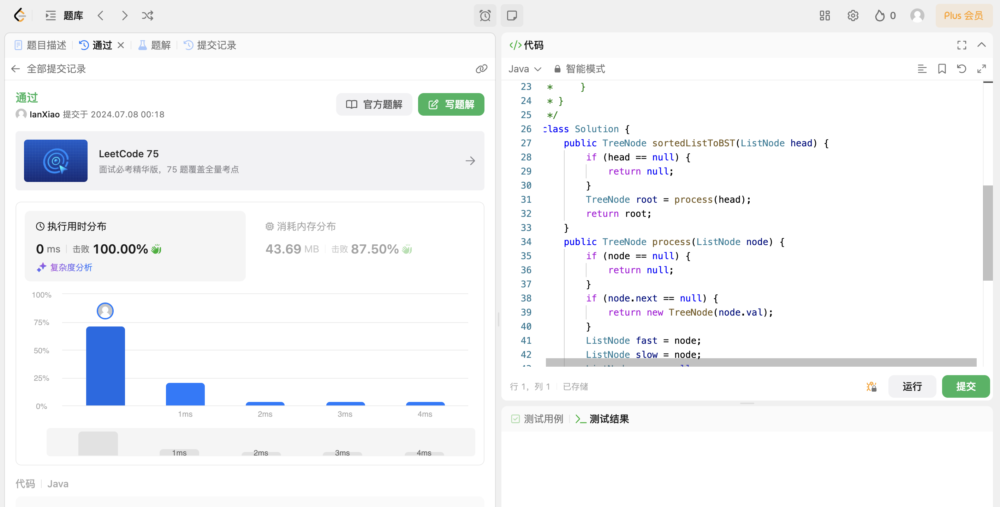

## Algorithm

# Review

[ReAct示例](https://github.com/dair-ai/Prompt-Engineering-Guide/blob/main/notebooks/react.ipynb)

[ReAct: synergizing reasoning and acting in language models](https://arxiv.org/pdf/2210.03629)

LLMs 以交错的方式生成 推理轨迹 和 任务特定操作 的框架，生成推理轨迹使模型能够诱导、跟踪和更新操作计划，甚至处理异常情况。

ReAct 框架允许 LLMs 与外部工具交互来获取额外信息，从而给出更可靠和实际的回应。

ReAct 可以在语言和决策任务上的表现要高于几个最先进水准要求的的基线。ReAct 还提高了 LLMs 的人类可解释性和可信度。总的来说，作者发现了将 ReAct 和链式思考 (CoT) 结合使用的最好方法是在推理过程同时使用内部知识和获取到的外部信息。

# Tips

# Share
