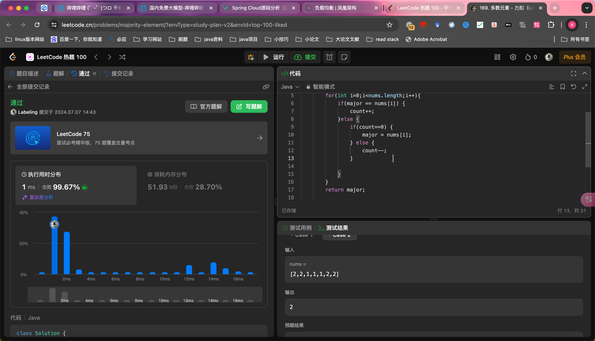

## Algorithm

- 排序取中间位次数据
- 摩尔投票进行冲突，举例：1 1 2， major = 1 ，遇到1 投票加1，遇到 2 投票减一

## Review

[design pattern](https://dev.to/moh_moh701/part-1-design-principles-in-software-development-4mgp?ref=dailydev)
- 单一职责
- 关注点分离
- DRY
- 防腐

## Tip

## Share
