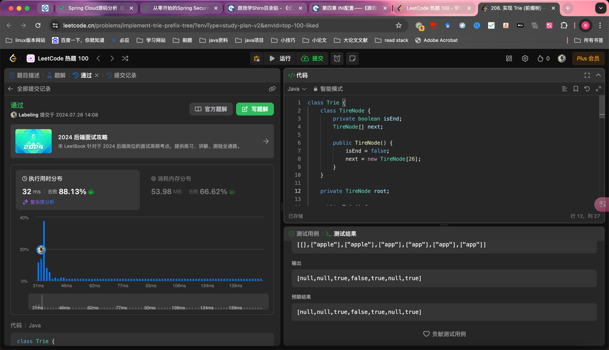

## Algorithm

- Tire多叉树
- 使用 c - 'a'存储是否存在
- TreeNode 组合模式多叉树
- 搜索判断是否end

## Review

[leader](https://dev.to/sampseiol1/my-first-experience-as-a-tech-lead-5g28?ref=dailydev)

* 代码质量
* 按期交付
* 培养团队

## Tip

## Share
